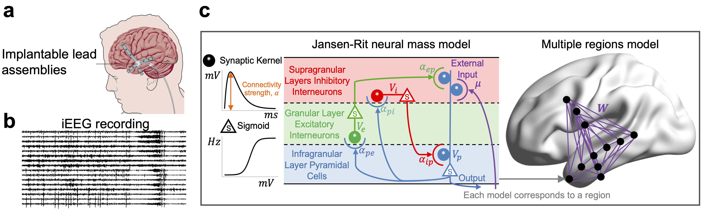
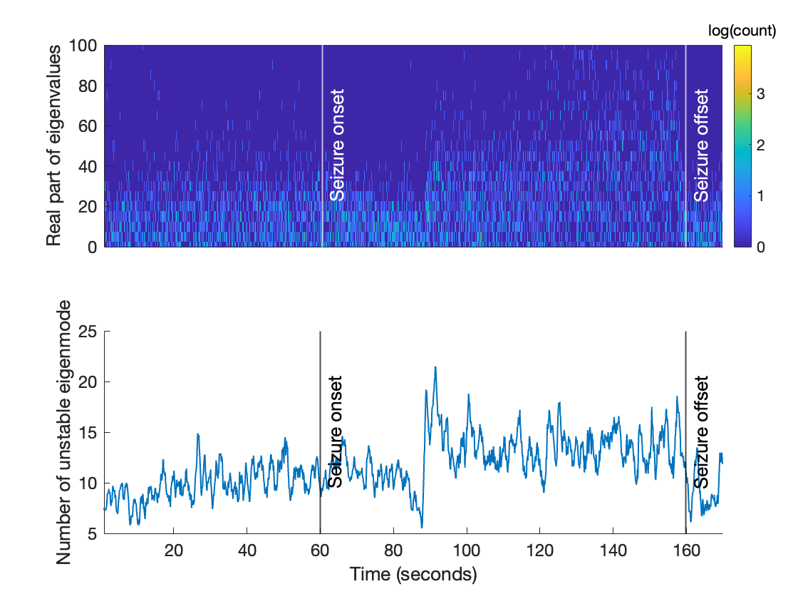
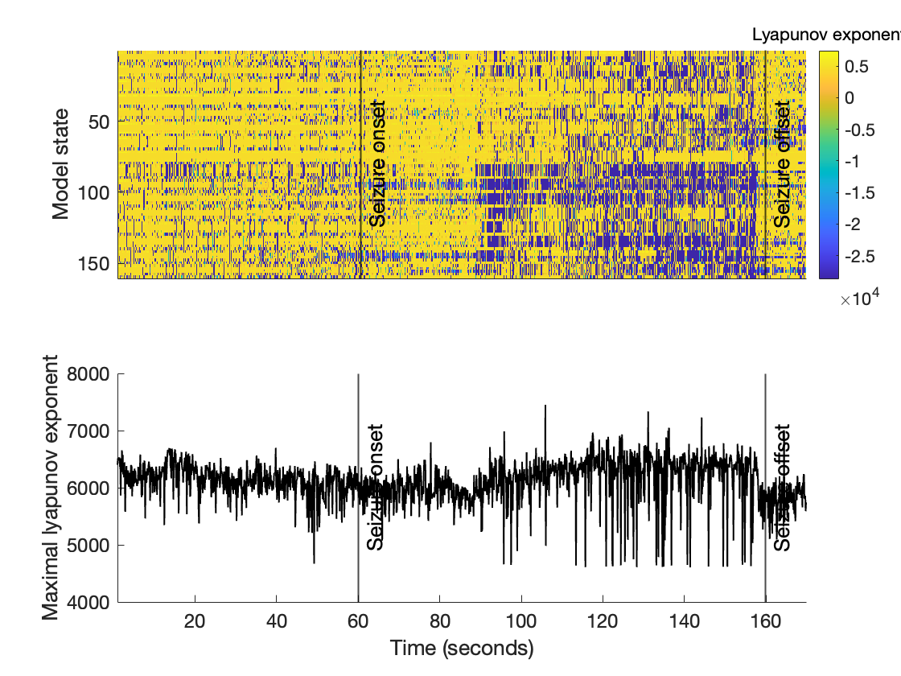
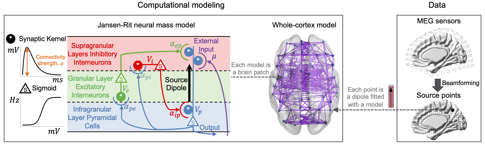
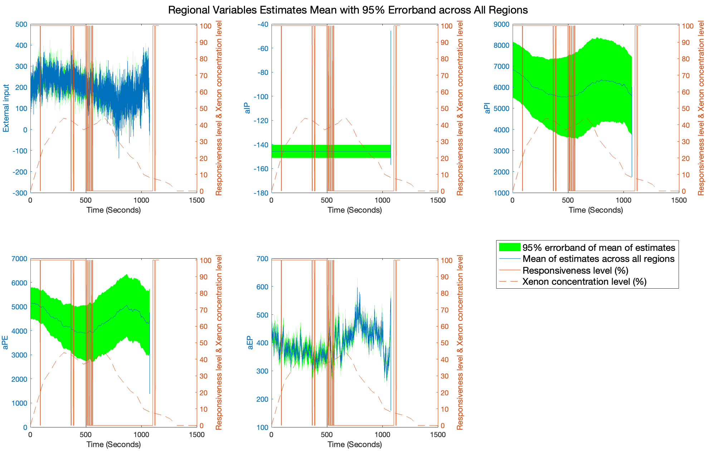
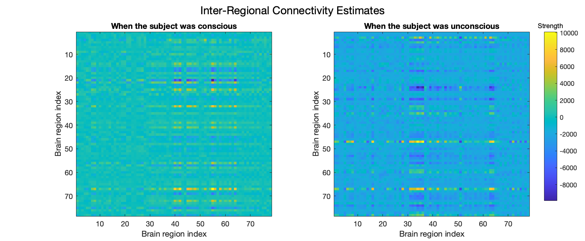
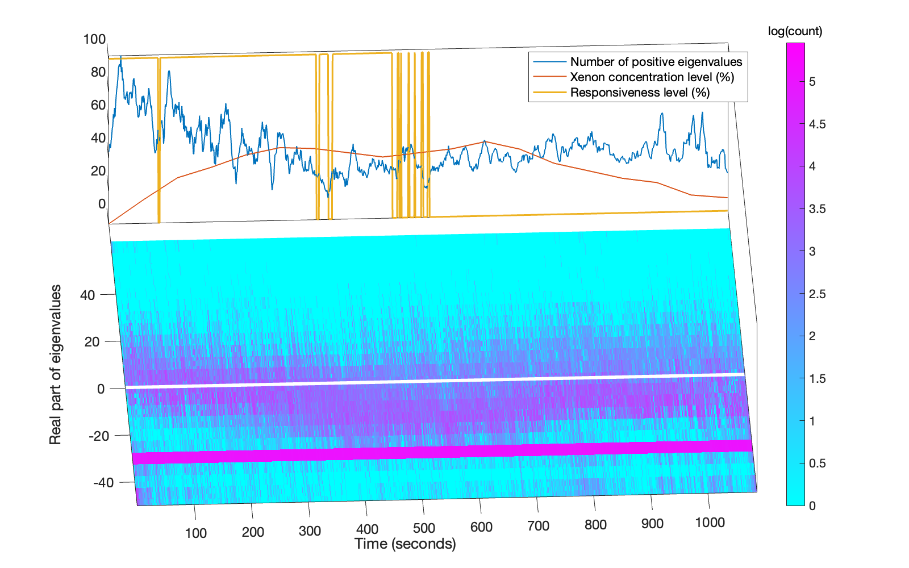

# NeuroProcImager-Pro
#### Yun Zhao (Monash University, Australia), Levin Kuhlmann (Monash University, Australia), David Grayden (The University of Melbourne, Australia) 

Contact Email: yun.zhao@monash.edu

**NeuroProcImager-Pro** was used in the below manuscripts 
1. *Cortical local dynamics, connectivity and stability correlates of global conscious states [Accepted for publication at Nature Communications Biology](https://www.nature.com/articles/s42003-025-08782-6)*.
2. *Cortical stability and chaos during focal seizures: insights from inference-based modeling [Journal of Neural Engineering](https://iopscience.iop.org/article/10.1088/1741-2552/add83f/meta)*,

**NeuroProcImager-Pro**, an extension of **NeuroProcImager** ([Github link](https://github.com/yundumbledore/NeuroProcImager/tree/main), [Neuroimage Paper link](https://www.sciencedirect.com/science/article/pii/S1053811922007078)), explores neurophysiological underpinnings of brain functions via analyzing
1. *dynamic cortical stability*
2. *dynamic cortical chaos*

In below, the methods of **NeuroProcImager-Pro** and its application to analyze cerebral cortical dynamics for focal epileptic seizures is demonstrated. Besides, a short demonstration is provided for analyzing the cortical stability for altering conscious states. 

## Methods

### Modelling the brain

The schematic of the multiple regions model fitted to 16-channel iEEG data is shown. The left side shows the device used to collect iEEG recording and an example of iEEG recording. The middle shows a neural mass model (NMM) and the right shows the multiple regions model. Each node in the multiple regions model is a NMM. Purple lines represent connections between NMMs. Each iEEG time series is fitted with a NMM. In this study, iEEG time series are used whereas our framework also applies to EEG and MEG data.

The NMM comprises three neural populations, namely excitatory (e), inhibitory (i), and pyramidal (p). The pyramidal population (in infragranular layers) driven by the external input $\mu$, excites the spiny stellate excitatory population (in granular layer IV) and inhibitory interneurons (in supragranular layers), and is excited by the spiny stellate excitatory population and inhibited by the inhibitory interneurons. Neural populations are characterized by their time varying mean (spatial, not time averaged) membrane potential, $v_n$ , which is the sum of contributing population mean post-synaptic potentials, $v_{mn}$ (pre-synaptic and post-synaptic neural populations are indexed by $m$ and $n$) and connected via synapses in which the parameter, $\alpha_{mn}$ quantifies the population averaged connection strength. $\alpha_{mn}$ is referred as the regional neurophysiological variables. In the figure above, there are four variables in a cortical region.

Coupling of two cortical regions is achieved by connecting the output of the pyramidal population in one region to the input of the pyramidal population in another region via a synapse. The synaptic connection strength from region $a$ to $b$ is referred as the inter-regional connectivity parameter $w_{ab}$. For the multiple regions model, the input to the pyramidal population at one cortical region is formed by the combination of post-synaptic membrane potentials induced by the output of the other regions.

### Parameter estimation
To estimate parameters of the whole-cortex model from data, we first treat each NMM in the multiple regions model independent and apply the semi-analytical Kalman filter (AKF) that we developed in [Neuroimage Paper link](https://www.sciencedirect.com/science/article/pii/S1053811922007078) to estimate parameters of each NMM. The AKF is an unbiased estimator, providing the minimum mean square error estimates for model parameters, under the assumption that the underlying probability distribution of the model state is Gaussian. Briefly, the aim of the estimation is to calculate the posterior distribution of model parameters at time point $t$ given measurements up to $t$. This gives time-varying parameter estimates.

To estimate inter-regional connectition strength $w$, we use the multivariate regression model to relate the input of the pyramidal population $\mu$ in one region to the output of the pyramidal population in other regions. The multivariate regression gives an estimate for $w$ and a bias term $e$ representing the contribution from thalamus input. The estimation is done in each time window, which result in time-varying $w$ and $e$ estimates.

### Dynamic cortical stability analysis
Linear stability analysis is performed in each time window where the averaged parameter estimates are used to define the system. Linear stability analysis is a mathematical technique used to determine the stability of equilibrium points in a dynamical system. The process involves linearizing the system of differential equations around the equilibrium point by computing the Jacobian matrix of the system's partial derivatives. This matrix represents the linear approximation of the system near the equilibrium. By analyzing the eigenvalues of the Jacobian, one can infer the stability of the equilibrium: if all eigenvalues have negative real parts, the equilibrium is stable; if any eigenvalue has a positive real part, the equilibrium is unstable. This method provides insights into the local behavior of the system and helps in understanding how small perturbations evolve over time.

The figure above shows a dynamic stability analysis for an example seizure recording. The top panel shows the time-varying Jocobi's eigenvalue spectrum. The color indicates the log scaled number of eigenvalue. The bottom panel shows the number of unstable eigenmode (with positive eigenvalues) as a function of time.

### Dynamic cortical chaos analysis
Chaos analysis is performed in each time window where the averaged parameter estimates are used to define the system. Chaos analysis in a dynamical system involves examining the system's behavior to identify the presence of chaotic dynamics, which are characterized by sensitivity to initial conditions, aperiodicity, and long-term unpredictability. To perform chaos analysis, one typically begins by computing Lyapunov exponents, which measure the rate of separation of infinitesimally close trajectories; a positive Lyapunov exponent indicates chaos. Additionally, tools such as phase space reconstruction and Poincaré sections can be used to visualize the system's trajectory and detect chaotic attractors. The bifurcation diagram is another useful tool, showing how the system's behavior changes as a parameter is varied, often revealing transitions from periodic to chaotic states. Lastly, the correlation dimension and fractal dimension can quantify the complexity of the system's attractors, further confirming chaotic behavior. These methods together provide a comprehensive understanding of the system's dynamics and the presence of chaos.

The figure above shows a dynamic chaos analysis for an example seizure recording. The top panel shows the time-varying Lyapunov spectrum. The color indicates the magnitude of exponent. The bottom panel shows the maximal Lyapunov exponent as a function of time.

## Another Demo - Cortical stability analysis for altering conscious states
This shows the stability of the cerebral cortex over time for an example subject during a Xenon-induced anesthesia experiment, where the subject starts awake, becomes unresponsive, and finally recovers from coma. The MEG data are pending ethical approval and are not available at this time. Below is a brief overview of the processing framework.

Here 78 cortical regions are identified based on AAL-atlas and each of them is fitted with a neural mass model. Neural mass models are inter-connected via long-range synaptic connections and the corresponding connectivity strength is modelled as effective connectivity matrix which is estimated from the data.

Note that each panel in the figure shows the averaged estimates of the five neural mass model parameters (i.e., external input $\mu$, $\alpha_{ip}$, $\alpha_{pi}$, $\alpha_{pe}$, $\alpha_{ep}$) across **78 cerebral cortical regions** (i.e., defined in AAL-atlas) in blue line with 95% confidence interval in green band. The level of responsiveness is denoted by solid brown line and the Xenon concentration level during the experiment is denoted by brown dashed line. The responsiveness level was measured by an auditory continuous performance task. Subjects were asked to respond as quickly as possible using two separate button boxes held in each hand. Use the left and right buttons on each box correspond to a low or high frequency tone, respectively, and the left and right button boxes, respectively, for the participant to indicate the absence or presence of nausea. When they were unable to answer or answered incorrectly, the responsiveness was 0%, indicating unconsciousness, and when they were able to answer correctly, the responsiveness was 100%, indicating a conscious state.

This figure shows two snapshots of estimated connectivity between brain regions, one taken at the beginning of the experiment when the subject was conscious, and the other taken when the subject was unresponsive.

This figure shows the **dynamic cortical stability analysis under xenon-induced asymptotic loss of consciousness**.

The bottom panel shows the time course of the eigenvalue spectrum, where dark colors indicate high density and light colors indicate low density. The top panel shows the time course of the number of positive eigenvalues, the subject's response level, and the xenon concentration level. Throughout the experiment, the number and magnitude of positive eigenvalues ​​first decreased and then increased, corresponding to the increase and then decrease of xenon concentration. The subjects responded at the beginning of the experiment where the positive eigenvalues ​​were the largest.

## Adaptation to your data
The package can be applied to your dataset. Steps are as follows:
1. Save your multi-channel iEEG/EEG/MEG data into a matlab data file with the format t x N where t is the number of time points and N is the number of channels,
2. Name it for example Seizure_009.mat and put it in the data folder,
3. Open run.m and change the value of 'data_file' to be the number seizure number for example 9,
4. Firstly estimate multi-region model parameters using the keyword 'parameter estimation',
5. Then, choose an analysis from 'stability analysis' and 'chaos analysis'.

Note that 
1. The framework can determine the number of neural mass models required based on N in the data.
2. The framework can typically run overnight on a standard CPU workstation, especially if N and t are large. The runtime depends heavily on the number of CPU cores and the size of the memory.

## Support and Help
Please raise your queries via the "Issues" tab or contact me (yun.zhao@monash.edu). I will respond **as soon as possible**.
